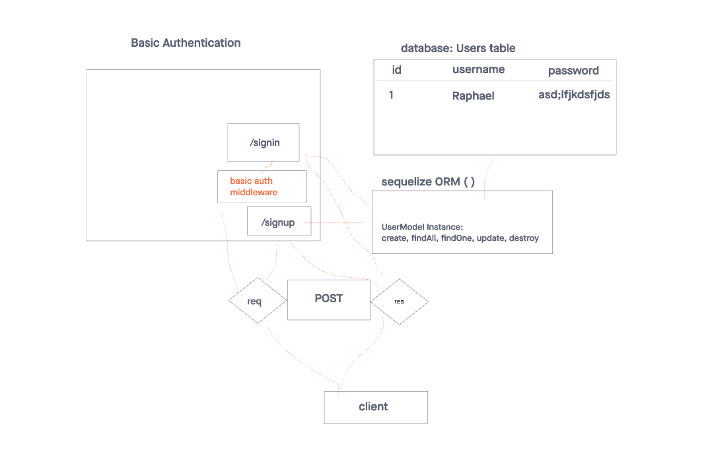

# Lab Class 06

## Project: Basic-Auth

Authentication System Phase 1: Deploy an Express server that implements Basic Authentication, with signup and signin capabilities, using a Postgres database for storage.

### Author: Raphael Chookagian

### Problem Domain

As a user, I want to create a new account so that I may later login
Using an HTTP REST client or a web form:
Make a POST request to the/signup route with username and password.
Your server should support both JSON and FORM data as input.
On a successful account creation, return a 201 status with the user object in the body.
On any error, trigger your error handler with an appropriate error.
As a user, I want to login to my account so that I may access protected information
Using am HTTP REST client, or a web form:
Make a POST request to the /signin route.
Send a basic authentication header with a properly encoded username and password combination.
On a successful account login, return a 200 status with the user object in the body.
On any error, trigger your error handler with the message “Invalid Login”.

### Links and Resources

- [ci,cd](https://github.com/cesarderio/basic-auth)
<!-- - [prod deployment](https://basic-auth-tg63.onrender.com) -->
<!-- - [dev deployment](https://basic-auth-dev-6rxb.onrender.com/) -->

### Setup

### `.env` requirements

see `.env.sample`

i.e.

- `PORT`
- `DATABASE_URL` - URL to the running Postgres instance/db

#### How to initialize/run your application (where applicable)

- nodemon

#### Features / Routes

- Feature One: Details of feature
- GET : `/` - specific route to hit
- GET : `/users` - specific route to hit
- GET : `bad` - specific route to hit

#### Tests

- How do you run tests?
  - npm test
- Any tests of note?
  - validator
  - logger
  - handles root path
  - handles errors
  handles invalid requests

- 404 on a bad route
- 404 on a bad method

The correct status codes and returned data for each REST route:

<!-- - Create a record using POST
- Read a list of records using GET
- Read a record using GET
- Update a record using PUT
- Destroy a record using DELETE -->

### Whiteboard

#### UML

## Terminology

- Query Parameter: `/person?name=Raphael`
- Path (URL) Parameter: `/person/name`
-
